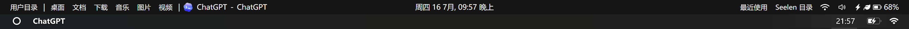
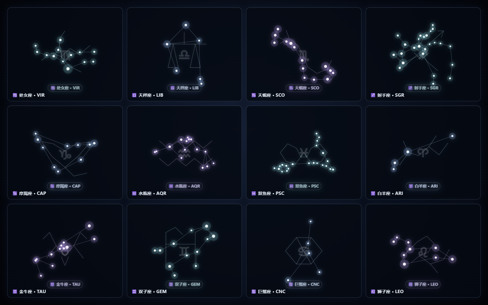

# Obsidian Glass Desktop

**A reversible Windows 11 ambient desktop shell for Dock, Stage rail, deep-space wallpaper, widgets, media status, and system controls.**

这是当前桌面项目的可移植开源整理版。项目名称从“Windows Desktop Startup Kit”升级为 **Obsidian Glass Desktop**：黑曜石玻璃、深空太极背景、左侧应用胶囊、底部 Dock、顶部状态栏和克制的环境光统一在一个可恢复的启动编排层里。

> 目标不是替换 Windows，而是在普通 Windows 11 上提供一个可退出、可恢复、可逐项启用的桌面体验层。

## 视觉布局

```text
┌────────────────────────────── Obsidian Glass Topbar ──────────────────────────────┐
│  AI / 文件 / 编辑 / 媒体 / 网络 / 电量                         当前模式与状态       │
├── left Stage Rail ───────┬──────────── deep-space workspace ───────────┬───────────┤
│  应用胶囊与窗口预览       │  太极流体 + 星系 + 流星 + 环境光 + 动态动物       │  可选组件  │
│  鼠标靠近展开             │  中间留白，动画分层，低频刷新                   │  日历/天气  │
├──────────────────────────┴─────────────────────────────────────────────┴───────────┤
│                 Obsidian Dock + 媒体进度 + 可选系统控制胶囊                    │
└────────────────────────────────────────────────────────────────────────────────────┘
```

## Showcase


<p align="center">
  
</p>

<p align="center">
  
  
  
</p>

<p align="center">
  
</p>



The screenshots are sanitized feature captures. Preview content, account names, and private chat/file text have been removed or masked before inclusion.

## 已整理的组件

| 区域 | 公开源码 | 作用 | 默认状态 |
|---|---|---|---|
| Dock | `src/components/dock/` | 固定应用、运行状态点、最近应用、窗口预览、微信兼容保护 | 可选 |
| 左侧栏 | `src/components/sidebar/` | Stage Manager 风格应用栏、窗口预览和拖动 | 可选 |
| Dashboard | `src/components/dashboard/` | 环境光、系统状态、控制胶囊、音乐/媒体接口 | 可选 |
| 顶栏 | `src/components/topbar/` | Seelen 顶部状态栏和媒体入口 | 可选，需外部配置 |
| Ambient | `src/components/ambient/` | Dock 显隐、媒体进度状态层 | 可选 |
| Wallpaper | `src/components/wallpaper/` | Lively WebGL 流体、深空层、十二星系/流星、动物轨迹 | 作为 Lively 壁纸导入 |

## 安全边界

- 兼容 Windows 11 / Windows PowerShell 5.1。
- 不修改 Windows 核心文件、BIOS、Defender、Windows Update、网络代理或个人文件。
- 不默认关闭安全功能，也不默认结束第三方进程。
- 只管理本工具自己创建的计划任务、启动快捷方式和已记录的组件进程。
- 状态、备份和日志写入 `%LOCALAPPDATA%\ObsidianGlassDesktop`，不会写回仓库。
- MyDockFinder、Seelen UI、Lively Wallpaper、Rainmeter 和可选语音运行时均属于外部依赖，必须逐项确认后启用。
- 顶栏安装脚本会备份并修改第三方配置，因此默认关闭；不需要顶栏时不要启用它。

## 快速开始

在 PowerShell 5.1 中进入本目录：

```powershell
cd .\open-source\obsidian-glass-desktop
```

先运行只读检查：

```powershell
powershell -ExecutionPolicy Bypass -File .\test.ps1
```

安全预览启动安装（不会写入任务或快捷方式）：

```powershell
powershell -ExecutionPolicy Bypass -File .\install.ps1
```

确认后，使用安全模板注册一个空的可恢复启动配置：

```powershell
powershell -ExecutionPolicy Bypass -File .\install.ps1 -Apply
```

要启用组件，请复制 `config\obsidian-glass.local.example.json` 为本地私有配置，逐项检查依赖和 `enabled` 字段，再执行：

```powershell
powershell -ExecutionPolicy Bypass -File .\install.ps1 -ConfigPath .\config\obsidian-glass.local.json -Apply
```

手动启动、查看状态和恢复：

```powershell
powershell -ExecutionPolicy Bypass -File .\start.ps1 -ConfigPath .\config\obsidian-glass.local.json
powershell -ExecutionPolicy Bypass -File .\status.ps1 -ConfigPath .\config\obsidian-glass.local.json
powershell -ExecutionPolicy Bypass -File .\restore.ps1
```

`restore.ps1` 只停止本工具记录的组件并移除本工具创建的启动入口；它不会卸载软件，也不会恢复或删除个人文件。

## 壁纸与动物轨迹

将 `src\components\wallpaper` 作为 Lively Wallpaper 的本地壁纸目录导入。默认包含深空流体、星点、星系、流星、环境光和 8 个动物 starter presets；动物轨迹引擎保留 80 个目录上限和 40 个同时活动上限。

完整 Petdex 目录的 1,593 条元数据也已保留。社区精灵图不进入公开 Git 提交；首次运行会从原始目录 URL 加载可用预览。需要在本机缓存 8 个 starter sprites 时：

```powershell
powershell -ExecutionPolicy Bypass -File .\tools\Sync-AnimalTrailAssets.ps1 -DownloadFromPetdex
```

全量精灵图约 3 GB。只在确认磁盘空间和素材权利后再执行：

```powershell
powershell -ExecutionPolicy Bypass -File .\tools\Sync-AnimalTrailAssets.ps1 -IncludeAllCatalogAssets -Force
```

该命令默认从本地缓存同步；也可以显式组合 `-DownloadFromPetdex -IncludeAllCatalogAssets -Force`。社区素材的再分发权利需要由使用者自行确认。

## 微信与语音输入说明

微信 4.x 的主内容区是 Qt 自绘窗口，Windows UI Automation 无法稳定定位内部语音按钮；因此本项目不会伪造点击或读取聊天内容。当前保留的是：窗口激活、Dock 预览保护、以及语音转文字期间的通信音量防误触逻辑。Windows 原生音量 OSD 是否显示，仍由系统设置决定，不由本项目强行隐藏。

## 截图

高分辨率功能截图存放在 `assets\screenshots\`，索引见 `docs\SCREENSHOT_CATALOG.md`。重新采集当前屏幕（只读，不切换壁纸或移动窗口）：

```powershell
powershell -ExecutionPolicy Bypass -File .\capture-screenshots.ps1 -Name overview
```

发布前必须检查截图中的聊天、文件名、账户名、地址和令牌。

## 项目结构

```text
obsidian-glass-desktop/
  assets/                         资产清单与公开截图
  config/                         安全模板与本地配置示例
  docs/                           源码映射、启动设计、发布检查
  src/components/dock/            Dock 与微信预览兼容层
  src/components/sidebar/          左侧 Stage rail
  src/components/dashboard/        环境光、控制胶囊和系统面板
  src/components/topbar/           顶部状态栏与媒体中心
  src/components/ambient/          Dock 显隐与媒体进度
  src/components/wallpaper/        WebGL 深空壁纸和动物轨迹
  src/lib/                         启动状态、路径和日志辅助函数
  tools/                           检查、截图和动物资源同步工具
```

## 许可与来源

仓库自身脚本使用 MIT 许可。壁纸目录保留原始 `LICENSE.txt` 和上游归属信息；应用图标、用户提供的壁纸、音乐、字幕和社区动物素材的许可状态见 `assets\manifest.json` 与 `docs\ASSET_CATALOG.md`。未确认授权的内容不应作为公开发行包的一部分。

## 后续迭代

建议先在干净的 Windows 11 虚拟机或测试账户中验证，再把已确认的组件配置放入私有配置文件。每次迭代都应先运行 `test.ps1`，再更新 `CHANGELOG.md` 和截图索引。
