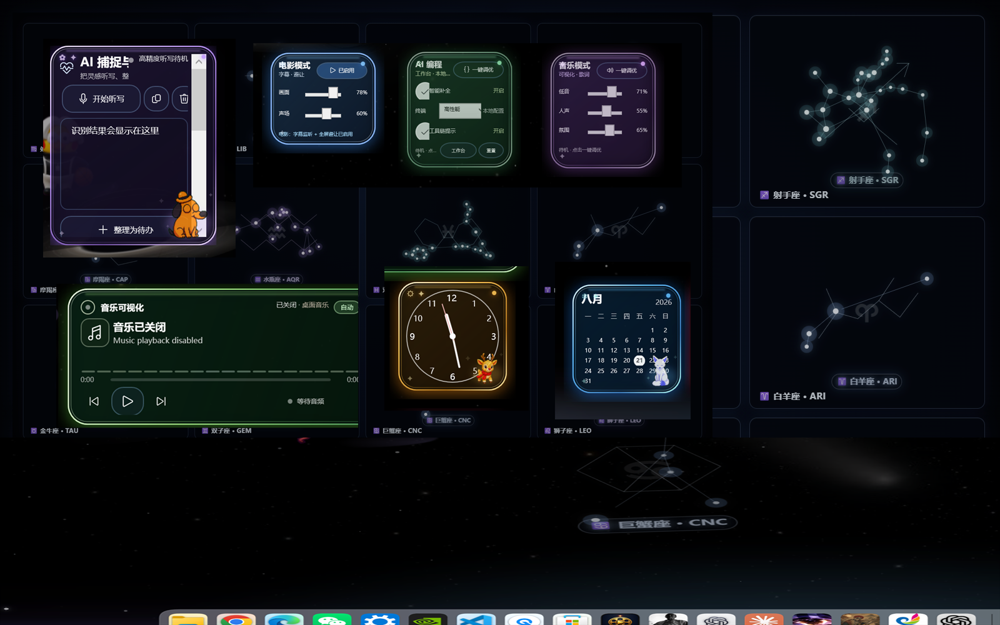
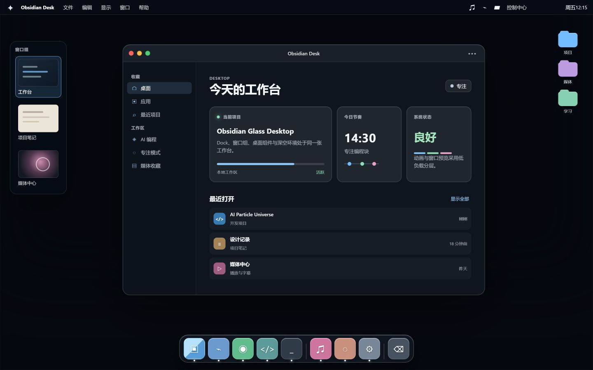
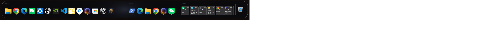
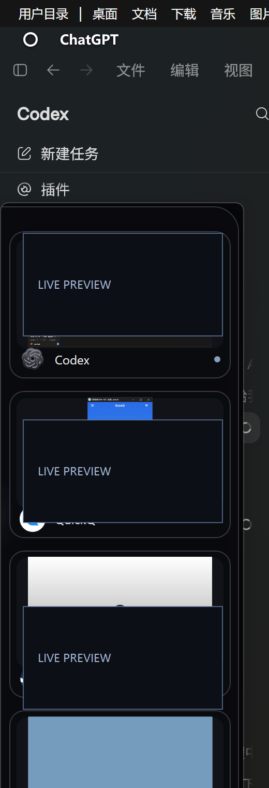
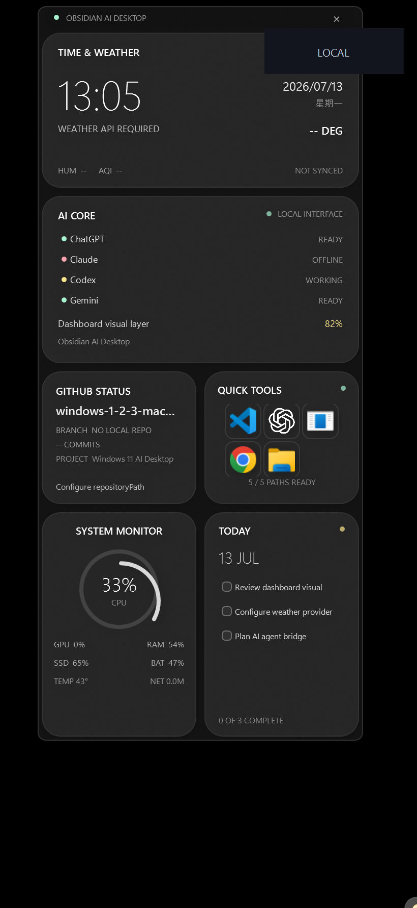
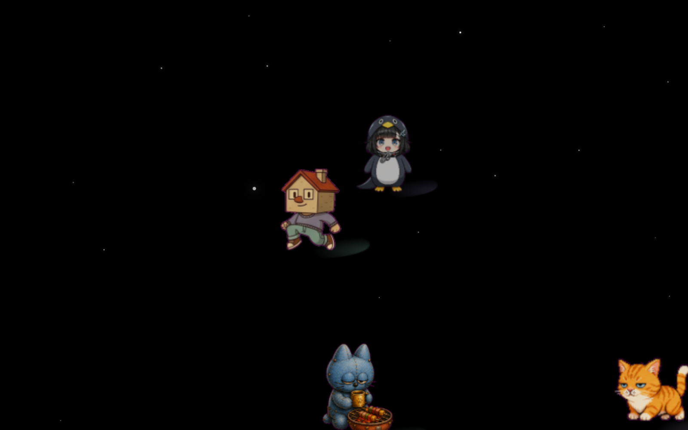
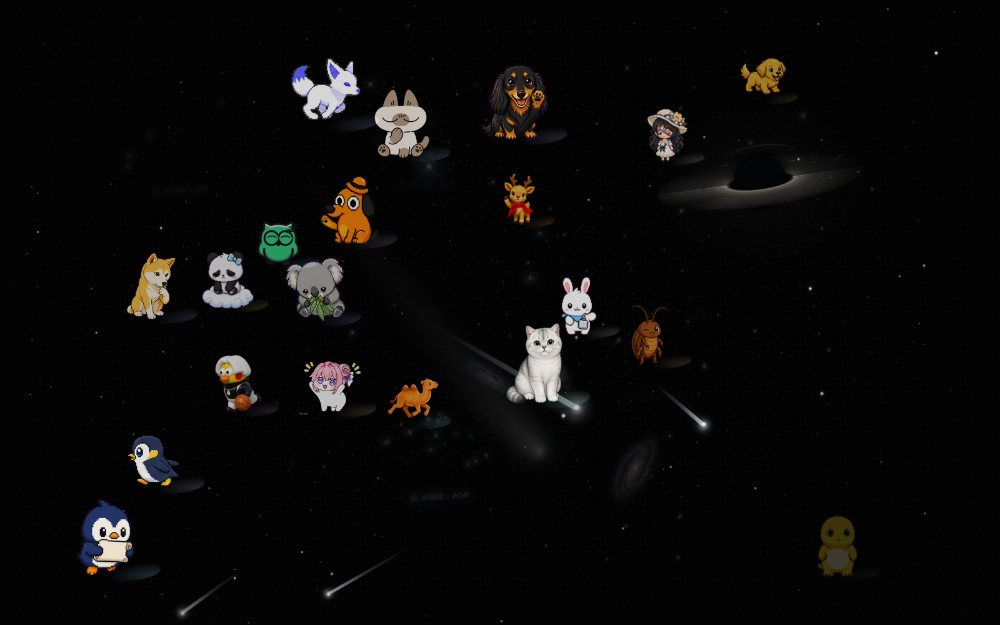

# Obsidian Glass Desktop · 当前版本

这是 **2026-08-21 当前工作区快照**，用于继承旧公开包并作为新分支继续开发。它不是旧版 `obsidian-glass-desktop` 的复制品：活动源码来自当前 Windows 11 桌面项目，历史备份、个人运行数据和本机缓存已被排除。



## 独立 Mac Desktop Edition

仓库新增一个独立、可直接打开的 Mac 风格桌面原型：[`mac-desktop-edition/`](mac-desktop-edition/)。它参考顶部菜单栏、窗口组、交通灯窗口、控制中心和底部 Dock 的信息结构，但不复制 Apple 标志、macOS 代码或系统资源。它只在浏览器内运行，不读取或修改 Windows、MyDockFinder、Lively、Seelen、当前组件状态、个人文件或启动项。



## 2026-08-21 最新版本

这个版本重点不是单独换一张壁纸或套一层皮肤，而是把桌面、窗口切换、媒体、AI 工作流和环境动画组织成一套可以独立启动、逐项关闭、完整恢复的 Windows 11 桌面工作台。

| 项目 | 当前状态 |
| --- | --- |
| 默认发布入口 | `main`，指向最新工作区快照 |
| 最新版本分支 | `codex/current-desktop-20260821` |
| 前一版本 | 作为独立历史分支保留，可比较、可回退 |
| 运行边界 | 当前用户权限，不替换 Windows Shell，不修改系统核心文件 |
| 公开边界 | 不包含个人媒体、聊天内容、缓存、日志、模型、账号信息或桌面原始截图 |

## 八项核心功能

### 1. Obsidian Glass 三区 Dock



- **APPS 固定应用区**：读取当前 MyDockFinder 应用，固定显示 14 个常用入口；点击优先激活已有窗口，未运行时才启动应用。拖动顺序只写入本项目状态文件，不改 MyDockFinder 核心文件。
- **ACTIVE 运行应用区**：Window Tracker 每 1.4 秒读取真实可见窗口，按应用归组并显示运行圆点；应用完全退出后自动离开，不使用静态假状态。
- **PAGES 驻留页面区**：只收纳真正最小化的窗口，每个窗口保留独立卡片。悬停 500ms 后使用 Windows DWM 显示实时画面，点击会恢复对应的精确窗口，恢复或关闭后卡片自动移除。
- **macOS 式交互**：中心图标放大到 `1.35`，相邻图标放大到 `1.15`；黑曜石玻璃、柔和白边、运行状态和废纸篓保持统一。
- **媒体进度**：Windows 原生媒体会话把电影、浏览器视频或音乐进度显示在对应应用下方，900ms 更新一次，仅在鼠标靠近 Dock 时显示。
- **全屏避让**：播放全屏电影或游戏时 Dock 自动移出屏幕并暂停点击，退出全屏后恢复。
- **微信专项修复**：按 `Weixin.exe` 与真实窗口句柄匹配当前主窗口，避免预览旧登录页；DWM 预览不把聊天截图保存到磁盘，也不读取聊天内容。

### 2. 左侧 Stage Manager 胶囊与实时窗口预览



- 默认隐藏在屏幕左边，只保留约 10px 触发区；鼠标靠边展开，移开自动收起。
- 210×820 黑曜石玻璃面板最多显示 7 个最近活跃窗口，按最后活动时间排序；点击卡片直接切换或恢复对应窗口。
- 每 1.8 秒读取可见顶层窗口，使用 DWM 原生实时缩略图，不进行高频截图轮询，不在磁盘留下窗口画面。
- 固定应用区支持新增应用、文件夹和网站，也支持拖动排序、重命名、换图标、固定和取消固定；引用的程序与文件夹不会被移动或删除。
- Seelen 横向预览在悬停 500ms 后展开，同一应用最多并列三个当前窗口；竖向窗口按比例完整显示，不拉伸。
- 微信优先绑定当前聊天主窗口；全屏电影或游戏期间整条边栏移出屏幕，并把扫描间隔降到 5 秒。

### 3. 可移动的桌面组件与实时状态



- 天气、时钟、日历、电池、系统状态、AI 捕捉、媒体、照片、应用使用时间和模式卡都是独立工具窗口，不粘成一整块。
- **时间与天气**：显示实时钟表、日期、当前天气和五日预报；天气服务不可用时读取本地缓存，不阻塞其他组件。
- **系统监控**：显示实时 CPU、GPU、内存、电池、存储、温度与网络状态；数据只在本机读取，不上传遥测。
- **媒体与字幕**：在同一张绿色玻璃卡中显示当前应用、标题、进度、频谱、同步歌词、双语字幕和最近播放记录。
- **微信生活照片**：支持拖入、导入和自动同步图片、视频、HEIC/HEIF 与 Live Photo 配套 MOV；缓存副本与原文件分离，不移动或删除微信原图。
- **AI 捕捉、待办与模式卡**：语音听写结果可编辑并整理为待办，电影、AI 编程和音乐模式保持独立按钮与状态。
- **音量与亮度胶囊**：读取 Windows 实时音量和显示器亮度，变化时在屏幕正上方短暂显示，约 1.45 秒后淡出；不替换或关闭 Windows 原生提示。
- 按住组件空白区域即可单独拖动，停止约 300ms 后保存位置；组件不置顶、不抢焦点，也不进入任务栏和任务视图。
- CPU、GPU、内存、电池、网络、当前媒体与前台应用时长来自本机实时状态。应用时长每 5 秒采样，只记录应用名称和秒数，不读取网页、聊天或文档正文。
- 普通应用打开时，桌面组件自动隐藏；回到桌面时恢复。播放电影或视频时只保留小型字幕媒体卡，其余组件继续隐藏，避免遮挡画面。
- AI 捕捉与行动中心支持纵向滚动，把本地听写、正文编辑和四条多行待办串成一条工作流，听写结果可以继续编辑、复制、清空或整理成待办。

### 4. 电影、AI 编程、音乐三种工作模式

- **电影模式**：准备实时双语字幕、媒体卡和全屏避让，不自动播放影片、不改变系统音量。
- **AI 编程模式**：显示 AI 捕捉与行动中心，启用本地补全、终端和工具链的组件内推荐参数，不修改 VS Code、注册表或全局开发环境。
- **音乐模式**：刷新当前媒体会话、18 段频谱和同步歌词，不强制启动播放器或自动播放音乐。
- 三种模式都可以再次点击或使用“重置”返回待机；状态只保存在项目 `data` 目录，视觉切换不写入系统设置。

### 5. 音乐可视化、电影记录与双语歌词

- 原音乐可视化与电影/音乐记录合并为同一张靠右的 440×142 绿色玻璃主卡，保留播放、暂停、进度和媒体按键。
- 优先读取 Windows 媒体会话；播放器未提供媒体会话时，可以使用 WASAPI 系统扬声器回录识别对白。
- 字幕第一行显示简体中文，第二行保留原语言；自动识别或手动选择英语、日语、韩语、西班牙语、法语、德语、俄语等 19 种语言。
- 有时间轴的歌曲按毫秒进度显示同步歌词；进入视频模式时会停用旧歌曲时间轴，避免歌词覆盖电影对白。
- Whisper 音频识别在本机隔离环境完成，不上传音频；只有需要网络翻译回退时才发送已识别的短句。网络不可用时仍保留原文。
- 最近记录最多保留 80 条，包含标题、来源、播放位置、总时长，以及播放期间的 CPU、GPU、内存和音频设备快照；右侧列表支持滚轮、触控板和触摸滑动。

### 6. 深空、十二星系、流星与动态动物



- Lively Wallpaper 中保留太极流体、远景星点、分层星云、十二星座轮换、星系、流星通道和轻量视差。
- 动态动物轨迹系统支持鼠标与触控板轨迹、闲置自主玩耍、群体行为、手势响应和低帧保护；动物在没有鼠标靠近时仍会执行自主动作。
- 当前公开包包含 1,593 条 Petdex 生物元数据和 8 个轻量 starter 精灵；完整素材缓存不随仓库发布，避免把约 3 GB 未逐项确认许可的社区素材直接打包。
- 性能配置把同时活跃动物控制在 40 只以内，目录槽位控制在 80 个；低帧时优先减少背景活动，不影响 Dock、字幕或窗口预览。

### 7. 底部环境光与 Dock 媒体状态层



- 真正的底部环境光代码位于 `src/components/wallpaper/ambient-light/`。`bottom-ambient-light.css` 绘制蓝、紫、粉三组柔光池、双层光带和地平线，`bottom-ambient-light.js` 负责 Lively 属性、暂停、鼠标、音频和低功耗状态。
- `src/components/wallpaper/index.html` 把环境光插在深空层与动物 Canvas 之间，因此它始终位于动物、Dock 和桌面组件后方，不创建可点击窗口，也不拦截桌面操作。
- 连续动画只使用 CSS `transform` 与 `opacity`；JavaScript 不建立独立渲染循环，鼠标响应最多只保留一个待执行的 `requestAnimationFrame`，避免与流体、动物和组件争抢帧预算。
- Lively 设置中可以开关环境光、把强度调到 `0-100`、选择蓝紫星云/青绿极光/暖金电影三种调色板，并分别开关鼠标和音乐响应。
- 动物脚下柔光与鼠标动物轨迹仍由 `animal-trail/animal-trail.js` 的 Canvas 层负责，和底部环境光是两个可独立关闭的层。
- Windows 媒体状态层位于 `src/components/ambient/`，独立读取播放会话并把进度线放在对应 Dock 应用下方；它与壁纸环境光互不依赖。
- 上图来自当前实际运行桌面的安全裁切，能直接看到 Dock 后方的青蓝底部光晕；没有使用概念图冒充运行效果。

### 8. 顶栏媒体中心、开机编排与一键恢复

- 顶栏保留原有项目和顺序，只增量提供截图库、屏幕录像、摄像头和“中/EN”切换；输入法只在简体中文与 English (US) 之间切换。
- 屏幕录像使用本机 FFmpeg，提供红色录制状态、独立开关和 `HH:MM:SS` 时长；摄像头预览使用 FFplay。只有用户点击相应按钮时才打开媒体面板。
- 启动过程采用分阶段延迟、单实例保护和低优先级后台工作：组件首屏先出现，字幕模型和媒体服务随后预热，避免所有美化进程同时挤在登录关键路径。
- DWM 预览不持续截图，频谱只在检测到播放时提高刷新率，组件隐藏时暂停频谱重绘；全屏期间 Dock 和边栏都降低扫描频率。
- `restore.ps1`、`restore-current-startup.ps1` 以及各组件自己的恢复脚本只撤销本项目创建的入口和视觉层，不卸载软件、不删除项目数据或个人文件。

## 目标

在普通 Windows 11 上叠加一层可退出、可恢复的桌面体验：

- 黑曜石玻璃 Dock：固定应用、运行状态、驻留页面和 DWM 实时预览。
- 左侧 Stage Manager 胶囊：最近窗口、应用图标、边缘唤出和横向实时预览。
- WPF 桌面组件：天气、时钟、日历、电量、AI 捕捉、待办、媒体进度、双语字幕和播放记录。
- 顶部媒体中心：截图、录像、摄像头、输入法切换和 X/GitHub Dock 操作。
- Lively 深空壁纸：太极流体、星点、十二星座、流星和动态动物轨迹。
- 当前用户级启动编排与恢复入口。

项目不替换 Windows，不修改系统核心文件，也不要求安装黑苹果或修改 BIOS。

## 当前快照来源

以下目录是当前版本的活动源码入口：

| 能力 | 当前源码 | 当前保留内容 |
| --- | --- | --- |
| Dashboard | `src/components/dashboard/` | 当前 `MacWidgetDashboard.ps1`、组件 XAML、音乐/字幕/语音服务、控制胶囊 |
| Dock | `src/components/dock/` | 当前三区 Dock、窗口跟踪、微信实时预览与运行黑点修复源码 |
| 左侧栏 | `src/components/sidebar/` | 当前 Stage Manager 胶囊、DWM 缩略图、Seelen 横向预览 |
| 顶栏 | `src/components/topbar/` | 当前媒体中心、录像时长、语言切换、X/GitHub/Claude 操作脚本 |
| Dock 媒体与显隐 | `src/components/ambient/` | 当前 Dock 显隐和媒体进度组件 |
| 底部环境光 | `src/components/wallpaper/ambient-light/` | 当前蓝紫环境光、鼠标/音频响应、暂停与低功耗适配 |
| 壁纸 | `src/components/wallpaper/` | 当前深空环境、星座、流星、动物轨迹和 Petdex 元数据 |
| Mac Desktop Edition | `mac-desktop-edition/` | 独立浏览器原型、顶部菜单、窗口组、控制中心与 Dock 交互；不连接本机桌面运行时 |
| 启动 | `src/current/` | 当前启动顺序的可移植版本及恢复脚本 |

精确的文件来源、哈希和排除清单见 `docs/CURRENT_SNAPSHOT.md` 与 `docs/current-source-manifest.json`。

## 快速检查

先做只读检查，不启动任何组件：

```powershell
powershell -ExecutionPolicy Bypass -File .\test.ps1
powershell -ExecutionPolicy Bypass -File .\start-current.ps1 -VerifyOnly
```

## 启动方式

### 只启动当前组件会话

```powershell
powershell -ExecutionPolicy Bypass -File .\start-current.ps1
```

它会按当前桌面使用顺序尝试启动 Dashboard、左侧栏、Dock、Dock 显隐控制，并在检测到时启动 MyDockFinder、Lively Wallpaper 和 Rainmeter。未安装的外部软件只写日志，不会被下载或强行安装。

### 单独启动组件

```powershell
powershell -ExecutionPolicy Bypass -File .\src\components\dashboard\start.ps1 -NoStartup
powershell -ExecutionPolicy Bypass -File .\src\components\sidebar\start.ps1 -NoStartup
powershell -ExecutionPolicy Bypass -File .\src\components\dock\start.ps1 -NoStartup
powershell -ExecutionPolicy Bypass -File .\src\components\ambient\start.ps1
```

### 可恢复的开机入口

默认配置是安全预览，所有组件关闭：

```powershell
powershell -ExecutionPolicy Bypass -File .\install.ps1
```

确认外部依赖和组件后，才使用：

```powershell
powershell -ExecutionPolicy Bypass -File .\install.ps1 -Apply
```

安装器只创建当前用户计划任务或用户启动快捷方式，不修改系统核心文件。恢复：

```powershell
powershell -ExecutionPolicy Bypass -File .\restore.ps1
powershell -ExecutionPolicy Bypass -File .\restore-current-startup.ps1
```

如果只想为这个当前分支创建独立的开机入口，请先预览，再显式应用：

```powershell
powershell -ExecutionPolicy Bypass -File .\install-current-startup.ps1
powershell -ExecutionPolicy Bypass -File .\install-current-startup.ps1 -Apply
```

它只使用当前用户权限，并只管理名为 `Obsidian Glass Desktop - Current` 的任务和同名启动快捷方式。旧版启动任务不会被迁移或删除。

## 语音、音乐与字幕

源码保留当前的本地语音识别、可编辑结果、电影双语字幕、同步歌词、媒体进度和播放历史逻辑。大模型、CUDA DLL、便携 Python、WebView2 数据和个人媒体没有放入 GitHub：

- 语音运行时默认位置：`%LOCALAPPDATA%\ObsidianGlassDesktop\runtime\speech`。
- 可通过环境变量 `OBSIDIAN_GLASS_SPEECH_ROOT` 指定自己的运行时目录。
- 缺少运行时会显示依赖不可用并保留界面，不会修改全局 Python 或 AI 开发环境。
- 当前收藏音乐的自动播放仍由现有桌面设置决定；公开包不会携带音频文件、歌词缓存或账号数据。

具体 Python 依赖见 `src/components/dashboard/speech/requirements-subtitles.txt`，安装到隔离运行时，不要覆盖系统环境。

## 深空壁纸与动物

把 `src/components/wallpaper/` 导入 Lively Wallpaper，即可使用当前网页壁纸源码。当前版本保留：

- 太极流体与分层深空环境。
- 十二星座轮换、星点漂移和流星通道。
- Dock 后方的底部环境光、三种调色板、鼠标和音乐响应。
- 动态动物轨迹系统：鼠标/触控板轨迹、闲置自主活动、群体行为、手势和低帧保护。
- Petdex 当前 1,593 条生物元数据和 8 个轻量 starter 精灵图。

完整 Petdex 精灵缓存约 3 GB，且社区素材许可需要逐项确认，因此不进入公开提交。需要时再按 `src/components/wallpaper/animal-trail/catalog/` 中的元数据自行同步，并保留原始来源声明。

## 外部依赖

| 依赖 | 作用 | 是否随包提供 |
| --- | --- | --- |
| Windows PowerShell 5.1 / WPF | 组件、Dock、左侧栏 | Windows 自带 |
| MyDockFinder | 底部 Dock 宿主 | 不提供，用户自行从 Steam/官网安装 |
| Seelen UI | 顶部栏和可选横向预览 | 不提供 |
| Lively Wallpaper | WebGL 深空壁纸宿主 | 不提供 |
| Rainmeter | 可选第三方皮肤 | 不提供 |
| FFmpeg / FFplay | 顶栏录像和摄像头功能 | 使用本机已有版本，不随包下载 |
| C# 编译器 | 微信预览/媒体进度辅助程序 | 只提供 `.cs` 源码，不提交 `.exe` |

## 安全边界

- 不删除个人文件，不清理微信、浏览器或媒体数据。
- 不关闭 Defender、Windows Update、安全中心或网络代理。
- 不修改 BIOS、驱动、系统核心文件或全局开发环境。
- 顶栏配置迁移、MyDockFinder 配置编辑和启动任务注册都需要显式运行对应脚本，并会先备份。
- 组件日志和状态写入本机运行目录或被 `.gitignore` 排除的目录，不应提交。

发布前运行 `test.ps1`，并人工检查 `git status`。安全规则见 `SECURITY.md`。

## 版本关系

- 旧版历史分支：`codex/publish-obsidian-glass-desktop`。
- 当前分支：`codex/current-desktop-20260821`。
- `main` 在发布完成后指向当前快照；旧分支仍保留，便于比较和回退。

这套分支策略保留旧版本，同时让当前桌面修改拥有独立、可追踪的发布点。
